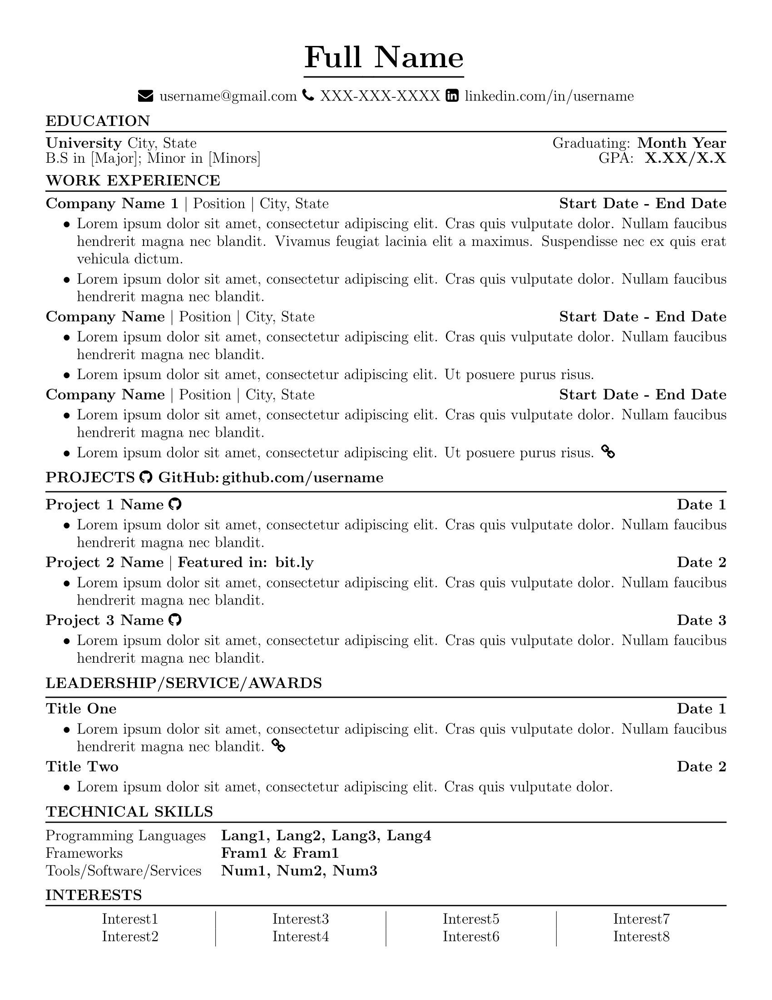

# Resume and cover letter template in LaTex

## Preview
| Resume | Cover Letter |
|:---:|:---:|
|[Download PDF](./resume-template/resume-template.pdf) |[Download PDF](./cover-letter-template/cover-letter-template.pdf) |
| |  |

## Motivation
I created these templates because I wanted to have a highly customizable resume and cover letter. Changing the format of a document on Google Docs or Microsoft Word can sometimes lead to frustration, and so I wanted to share an example of two LaTex templates I created.

## Usage
Both templates use the article document class and are commented on to provide clarification and additional references in certain lines. For the resume, I used customized sections instead of using the built-in section/subsection commands in the article class. The cover letter template is straight forward, so having a basic knowledge of Latex would be helpful. However, a fair warning that these templates may not follow the best practices of using LaTex since I am not very familiar with it. 

## Additional Information
The page size of each template 8 x 11 inches which is the standard printing paper size. It is specified on the top of each .tex file by using the "letterpaper" option file. On the same line, the page margins are defined and can easily be modified. 

To create your own signature for the cover letter, visit [signature.imageonline.co](https://signature.imageonline.co). You can use an editor like GIMP or Microsoft Paint to crop out the excessive white background after the the .png file has been downloaded.

## License 
I intended these files to be modified and redistributed which is why this repository is under the MIT License.  